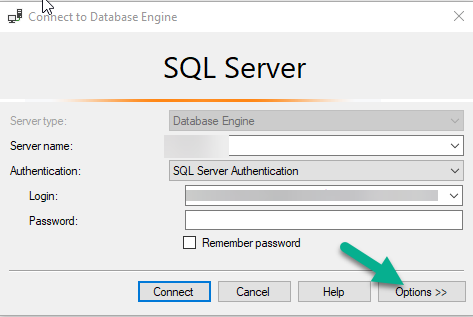
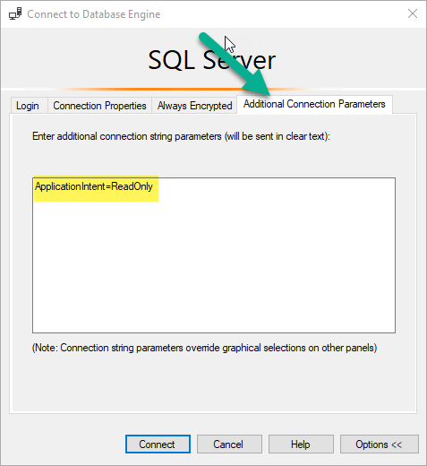

# Setup MSSQL read-replicas with High-Availablitity

Ref: [https://docs.microsoft.com/en-us/sql/linux/sql-server-linux-availability-group-configure-rs?view=sql-server-2017](https://docs.microsoft.com/en-us/sql/linux/sql-server-linux-availability-group-configure-rs?view=sql-server-2017)

## Step 1: Custom Dockerfile

We want to use a custom Dockerfile where high avalability and sql agent is enabled from the root folder

```bash
docker build -t sqlag:ha .
```

## Step 2: Docker-compose with 3 nodes

Create three nodes with `docker-compose`:

* sqlNode1: Primary server
* sqlNode2: Secondary server
* sqlNode3: Secondary server

```bash
cd ./read-replicas-ha-docker
docker-compose up -d
```

## Step 3: Setup certificates with Transparent Data Encryption (TDE)

Follow the steps to create certificates on the nodes:

1. Create certificate for primary node, store it in a temp location in the node
1. Copy the certificate from the primary node to local system
1. Copy the certificate from local system to secondary nodes
1. Apply the certificate on secondary nodes

```sql
USE master
GO

CREATE LOGIN dbm_login WITH PASSWORD = 'Password1';
CREATE USER dbm_user FOR LOGIN dbm_login;
GO

CREATE MASTER KEY ENCRYPTION BY PASSWORD = 'Password1';
go
CREATE CERTIFICATE dbm_certificate WITH SUBJECT = 'dbm';
BACKUP CERTIFICATE dbm_certificate
TO FILE = '/tmp/dbm_certificate.cer'
WITH PRIVATE KEY (
      FILE = '/tmp/dbm_certificate.pvk',
      ENCRYPTION BY PASSWORD = 'Password1'
   );
GO
```

Now, let's copy the certificate from primary and paste them into the secondary nodes.

```bash
docker cp sqlNode1:/tmp/dbm_certificate.cer .
docker cp sqlNode1:/tmp/dbm_certificate.pvk .
docker cp dbm_certificate.cer sqlNode2:/tmp/
docker cp dbm_certificate.pvk sqlNode2:/tmp/
docker cp dbm_certificate.cer sqlNode3:/tmp/
docker cp dbm_certificate.pvk sqlNode3:/tmp/
```

Connect to all the secondary nodes and execute the following SQL:

```sql
CREATE LOGIN dbm_login WITH PASSWORD = 'Password1';
CREATE USER dbm_user FOR LOGIN dbm_login;
GO

CREATE MASTER KEY ENCRYPTION BY PASSWORD = 'Password1';
-- ALTER MASTER KEY REGENERATE WITH ENCRYPTION BY PASSWORD = 'Password1';
GO
CREATE CERTIFICATE dbm_certificate
   AUTHORIZATION dbm_user
   FROM FILE = '/tmp/dbm_certificate.cer'
   WITH PRIVATE KEY (
   FILE = '/tmp/dbm_certificate.pvk',
   DECRYPTION BY PASSWORD = 'Password1'
);
```

## Step 4: Enabled the High Availability endpoint

First enable the HA endpoint for database mirroring on the master, then on the replicas

```sql
CREATE ENDPOINT [Hadr_endpoint]
   AS TCP (LISTENER_IP = (0.0.0.0), LISTENER_PORT = 5022)
   FOR DATA_MIRRORING (
      ROLE = ALL,
      AUTHENTICATION = CERTIFICATE dbm_certificate,
      ENCRYPTION = REQUIRED ALGORITHM AES
      );
ALTER ENDPOINT [Hadr_endpoint] STATE = STARTED;
GRANT CONNECT ON ENDPOINT::[Hadr_endpoint] TO [dbm_login];
```

Finally enable the monitoring on master node.

```sql
ALTER EVENT SESSION  AlwaysOn_health ON SERVER WITH (STARTUP_STATE=ON);
GO
```

## Step 5: Create the availability group

On the master

```sql
CREATE AVAILABILITY GROUP [AG1]
      WITH (CLUSTER_TYPE = NONE)
      FOR REPLICA ON
      N'sqlNode1'
            WITH (
            ENDPOINT_URL = N'tcp://sqlNode1:5022',
            AVAILABILITY_MODE = ASYNCHRONOUS_COMMIT,
               SEEDING_MODE = AUTOMATIC,
               FAILOVER_MODE = MANUAL,
            SECONDARY_ROLE (ALLOW_CONNECTIONS = ALL)
               ),
      N'sqlNode2'
            WITH (
            ENDPOINT_URL = N'tcp://sqlNode2:5022',
            AVAILABILITY_MODE = ASYNCHRONOUS_COMMIT,
               SEEDING_MODE = AUTOMATIC,
               FAILOVER_MODE = MANUAL,
            SECONDARY_ROLE (ALLOW_CONNECTIONS = ALL)
               ),
      N'sqlNode3'
            WITH (
            ENDPOINT_URL = N'tcp://sqlNode3:5022',
            AVAILABILITY_MODE = ASYNCHRONOUS_COMMIT,
               SEEDING_MODE = AUTOMATIC,
               FAILOVER_MODE = MANUAL,
            SECONDARY_ROLE (ALLOW_CONNECTIONS = ALL)
               );
GO

ALTER AVAILABILITY GROUP [ag1] GRANT CREATE ANY DATABASE;
GO
```

## Step 6: Join the secondaries to the availability group

then join the replicas to the Availability group

```sql
ALTER AVAILABILITY GROUP [ag1] JOIN WITH (CLUSTER_TYPE = NONE);
ALTER AVAILABILITY GROUP [ag1] GRANT CREATE ANY DATABASE;
GO
```

## Step 7: Create a test database to replicate

```sql
CREATE DATABASE agtestdb;
GO
ALTER DATABASE agtestdb SET RECOVERY FULL;
GO
BACKUP DATABASE agtestdb TO DISK = '/var/opt/mssql/data/agtestdb.bak';
GO

ALTER AVAILABILITY GROUP [ag1] ADD DATABASE [agtestdb];
GO

USE agtestdb;
GO

CREATE TABLE inventory (id INT, name NVARCHAR(50), quantity INT);
GO
INSERT INTO inventory VALUES (1, 'banana', 150); INSERT INTO Inventory VALUES (2, 'orange', 154);
GO
```

Replication should work now. The `agtestdb` database should be available on the secondary nodes now.

## Step7: Make the replicas readonly

In this step, we'll do the following:

* Change the secondary replicas to allow read only connections
* Create read only routing url for each nodes
* Create the routing list

> Note that, the read-only routing URL should be such that you are able to connect from outside the container, so it's better to provide the actual IP of the node.

Execute the following SQL on primary node.

```sql
ALTER AVAILABILITY GROUP [AG1]
MODIFY REPLICA ON
N'sqlNode1' WITH
   (SECONDARY_ROLE (ALLOW_CONNECTIONS = READ_ONLY));

ALTER AVAILABILITY GROUP [AG1]
MODIFY REPLICA ON
N'sqlNode1' WITH
   (SECONDARY_ROLE (READ_ONLY_ROUTING_URL = N'tcp://172.16.238.21:1433'));


ALTER AVAILABILITY GROUP [AG1]
MODIFY REPLICA ON
N'sqlNode2' WITH
   (SECONDARY_ROLE (ALLOW_CONNECTIONS = READ_ONLY));

ALTER AVAILABILITY GROUP [AG1]
MODIFY REPLICA ON
N'sqlNode2' WITH
   (SECONDARY_ROLE (READ_ONLY_ROUTING_URL = N'tcp://172.16.238.22:1433'));


ALTER AVAILABILITY GROUP [AG1]
MODIFY REPLICA ON
N'sqlNode3' WITH
      (SECONDARY_ROLE (ALLOW_CONNECTIONS = READ_ONLY));

ALTER AVAILABILITY GROUP [AG1]
MODIFY REPLICA ON
N'sqlNode3' WITH
      (SECONDARY_ROLE (READ_ONLY_ROUTING_URL = N'tcp://172.16.238.23:1433'));


ALTER AVAILABILITY GROUP [AG1]
MODIFY REPLICA ON
N'sqlNode1' WITH
   (PRIMARY_ROLE (READ_ONLY_ROUTING_LIST=(('sqlNode3','sqlNode2'),'sqlnode1')));

ALTER AVAILABILITY GROUP [AG1]
MODIFY REPLICA ON
N'sqlNode2' WITH
   (PRIMARY_ROLE (READ_ONLY_ROUTING_LIST=(('sqlNode1','sqlNode3'),'sqlnode2')));

ALTER AVAILABILITY GROUP [AG1]
MODIFY REPLICA ON
N'sqlNode3' WITH
      (PRIMARY_ROLE (READ_ONLY_ROUTING_LIST=(('sqlNode1','sqlNode2'),'sqlnode3')));

GO
```

## Step 10: Create a listener URL

```sql
--ALTER AVAILABILITY GROUP [AG1] REMOVE LISTENER 'AGListener';
--GO

ALTER AVAILABILITY GROUP [AG1]
      ADD LISTENER 'AGListener' ( WITH IP ( (N'172.16.238.21', N'255.255.255.0') ) , PORT = 1434 );
GO
```

## Connecting to replicas readonly

### Connecting through CLI

Let's first connect to out primary replica

```bash
sqlcmd -S 172.16.238.21,1434 -U SA  -d agtestdb -P "Password1"
```

Now let's connect to secondary replicas using ReadIntent Only

```bash
sqlcmd -S 172.16.238.21,1434 -U SA  -d agtestdb -P "Password1" -K ReadOnly
```

### Connecting through SSMS



Add `ApplicationIntent=ReadOnly` to the Additional Connection Parameters



## References

* [https://hasura.io/docs/latest/guides/mssql/mssql-read-replicas-docker-setup/](https://hasura.io/docs/latest/guides/mssql/mssql-read-replicas-docker-setup/?utm_source=pocket_mylist)
* [https://www.mssqltips.com/sqlservertip/7384/enable-tde-sql-server-alwayson-availablity-group/?utm_source=pocket_mylist](https://www.mssqltips.com/sqlservertip/7384/enable-tde-sql-server-alwayson-availablity-group/)
